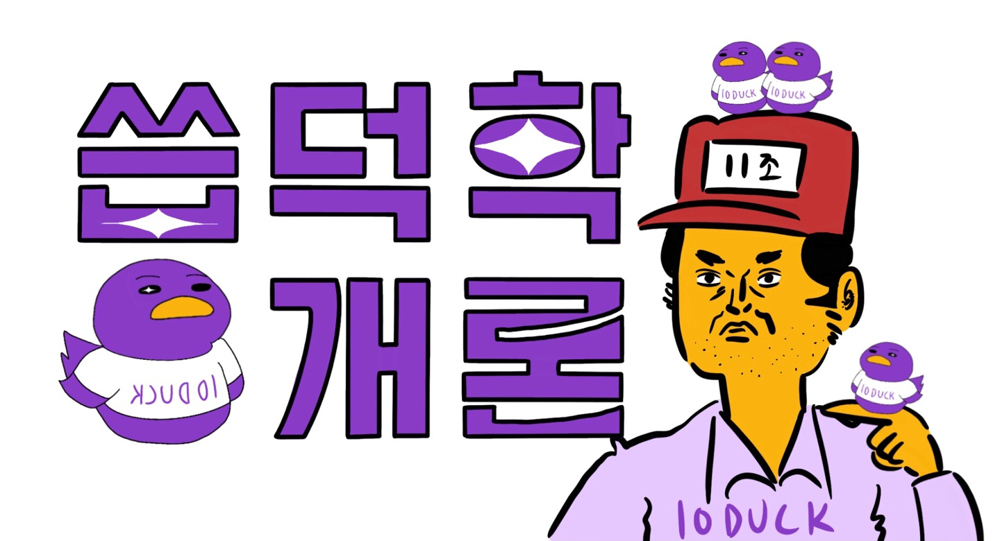
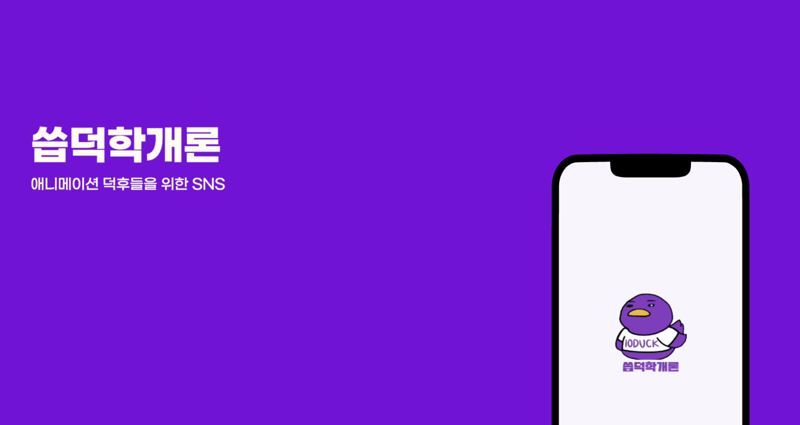
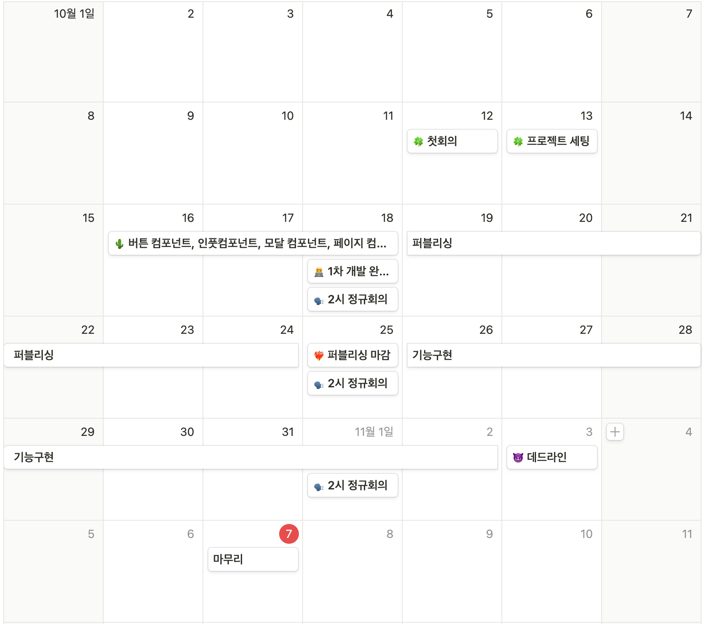
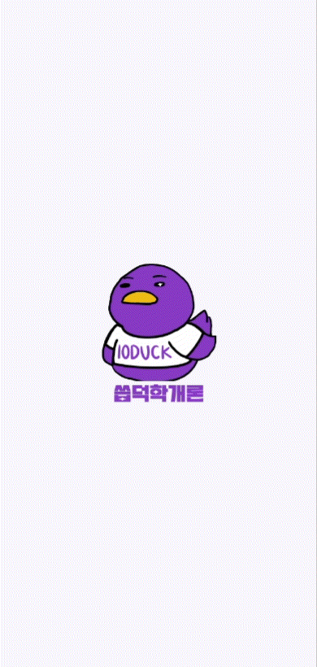
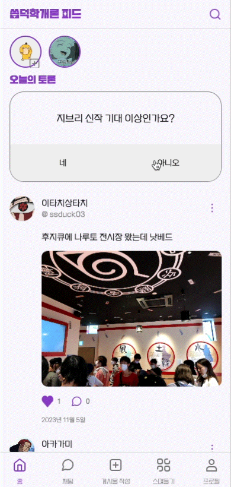
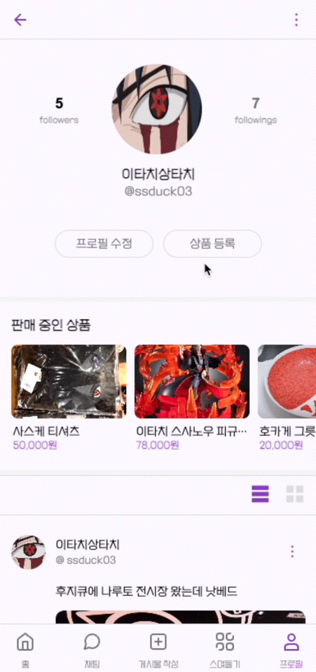

<div align='center'>
    <h1><b>씁덕학개론💫</b></h1>
        
        <br/>
		<br/>
		<h3><b>애니메이션이 조금 수줍다면 👀</b></h3>
        <h3><b>✨ 씁 덕 학 개 론 ✨</b></h3>
		<br/>


</div>

<br />

> 🗝️ **씁덕학개론 배포 링크 및 테스트 계정**

👉 [씁덕학개론 시작하기](https://main--neon-concha-a0860d.netlify.app/)


```md
ID: 10duck@test.com
PW: test1234
```

<br />

> 📑 **프로젝트 발표자료**

👉 [PPTX](https://mammoth-sassafras-ff5.notion.site/8c0c6215b5ee4c2f808d46545c2fe344?pvs=4)

<br />

## 📢 **1. 서비스 소개**

애니매이션을 사랑하는 모든 이들을 위한 온라인 소통 플랫폼, ✨**씁덕학개론**✨을 소개합니다!

우리는 보통 이런 고민을 합니다.

- 애니메이션 추천은 어디서 받아야할까?
- 애니메이션을 본 이후에 토론할 사람이 필요해!
- 애니매이션은 조금 수줍어... 소통할 커뮤니티가 필요해...
- 가챠하고 그 굿즈들을 거래하는 전용 플랫폼은 왜 없을까?

그래서 준비했습니다!
<br />
<br />
애니매이션 덕후들을 위한 ✨**씁덕학개론**✨은
<br />
좋아하는 작품과 캐릭터에 대해 서로 편하게 스며들고, 공유하고, 관련 상품도 거래할 수 있는 서비스입니다.
<br />
<br />
이젠 더 이상 부끄럽지 않아! 수줍지 않아! ✨**씁덕학개론**✨과 함께니까!

<br />
<br />

## 🐈 **2. 씁덕학개론 팀원 소개**

```
안녕하세요👋
저희는 멋쟁이사자처럼 11조
Re:액트부터 시작하는 이세계 코딩✨🧑‍💻입니다 !

팀원 모두가 다양한 레벨의 애니메이션을 좋아하고,
React로 하는 첫 프로젝트여서 많은 고민과 토론을 거쳐
유명 애니 제목을 오마쥬하여 팀명을 짓게 되었습니다 :)
```

<div align="center">

| <br/>  |                <br/>                 |                <br/>                  |                                       <br/>                                        |
| :-----------------------------------------------------------------------------------------------------------------------------: | :-------------------------------------------------------------------------------------------: | :--------------------------------------------------------------------------------------------: | :-----------------------------------------------------------------------------------------------------------------------------------------: |
|                                    |  |  |  |
|                                             [🐈‍⬛서주예](https://github.com/samweol)                                              |                             [🍊오규영](https://github.com/oqoqoh)                             |                          [🍙이서연](https://github.com/catisverycute)                          |                                                   [🥰이은경](https://github.com/egyeong)                                                    |

</div>

<!-- Top Button -->
<p style='background: black; width: 32px; height: 32px; border-radius: 50%; display: flex; justify-content: center; align-items: center; margin-left: auto;'><a href="#top" style='color: white; '>▲</a></p>

<br />

## 📅 **3. 개발 일정**

🐥 2023.10.16 - 2023.11.07

- 개발 일정은 노션의 [일정 캘린더](https://mammoth-sassafras-ff5.notion.site/50a2c43660624df18a9538ac1026565e?v=97c2e8ff773e4cc9ba3b1d99cd94d236&pvs=4)와 깃허브의 [프로젝트 관리](https://github.com/orgs/FRONTENDSCHOOL7/projects/3)를 만들어 개발

<br />

| 주차                             |                                                                                                                                                    |
| -------------------------------- | -------------------------------------------------------------------------------------------------------------------------------------------------- |
| **사전 모임**<br>(10/12 ~ 10/13) | - 주제 선정, 기술 스택 및 협업툴 결정 (`Notion`, `Discord`, `Figma`)<br>- Figma 디자인 작업 및 기획, 컨벤션 설정<br>- Git Project, Issue 규칙 설정 |
| **1주차**<br>(10/16 ~ 10/22)     | - 공통 컴포넌트 명세서 작성<br>- 공통 컴포넌트 개발 (`Layout`,`Header`,`Footer`,`Button`,`Modal` 등)                                               |
| **2주차**<br>(10/23 ~ 10/29)     | - 각 페이지 개인 별로 분담<br>- 각 페이지 마크업 & 스타일링 작업<br>- 페이지 단위 별 1차 기능 구현                                                 |
| **3주차**<br>(10/30 ~ 11/5)      | - 페이지 단위 2차 기능 구현<br>- 추가기능 구현 (투표, 스며들기, 스토리 추가 기능)                                                                  |
| **4주차**<br>(11/6 ~ 11/7)       | - 통합 테스트 및 에러 수정<br>- 배포(`Netlify`)<br>- README 작성                                                                                   |

<br />



<!-- Top Button -->
<p style='background: black; width: 32px; height: 32px; border-radius: 50%; display: flex; justify-content: center; align-items: center; margin-left: auto;'><a href="#top" style='color: white; '>▲</a></p>

<br />

## ⚙️ **4. 기슬 스택 및 개발 환경**

### 🛠️ 기술스택

|                       |                                                                                                 |
| --------------------- | ----------------------------------------------------------------------------------------------- |
| 개발 환경             | - FE: `React`, `Axios`, `Recoil`, `styled-components`<br>- BE: `제공된 RESTful API`, `Firebase` |
| **버전 및 이슈 관리** | - `Git`, `Github`, `Notion`                                                                     |
| **프로젝트 관리**     | - `Github Issues`, `Github Pull Requests`                                                       |
| **커뮤니케이션**      | - `Notion`, `Discord`                                                                           |
| **배포**              | - `Netlify` 작성                                                                                |

<p>


</p>

#### why?

- 상태관리 :
  - 트랜드 캐치와 기술 향상 목적으로 Redux 보다 비교적 러닝커브가 낮은 Recoil을 사용
- 스타일링 :
  - 짧은 기간이고 재사용성을 높이기 위해 Styled Components를 사용했고 시멘틱 마크업을 유지하며 ​​개발
- 배포 :
  - 지속적인 유지 보수를 위해 하루 배포 횟수가 적게 제한된 Vercel 보다 Netlify로 배포.

#### 소통은?

- 매일 10시, 디스코드로 데일리 스크럼
- 매주 수요일 14시, 정기 회의 및 회고록 작성

<br/>

👉 [notion 바로가기](https://mammoth-sassafras-ff5.notion.site/Re-11-6b1db046902648aca2e4500adee0ca96?pvs=4)
<br/>
👉 [API 명세 바로가기](https://toothsome-debt-b2b.notion.site/API-1c9f20ecba054f5ebfbaff4b65243976?pvs=4)
<br/>
👉 [회의록 바로가기](https://mammoth-sassafras-ff5.notion.site/e4f511ce07244b3c9cc7239f3d9c95ba?pvs=4)

<br/>

### 🤝 커밋 컨벤션

```
Feat➕:  새로운 기능을 추가하는 경우
Fix 🐛: 버그, 오류 수정
Docs 📝: readme.md, json 파일 등 수정, 라이브러리 설치할 경우
Style 🎨: 코드 포맷 변경, 세미콜론 누락, 코드 수정이 없는 경우
Refactor ♻️: 코드 리팩토링
Test 🚧: 테스트 코드 추가, 삭제, 변경 등
Chore 👷: 빌드 업무 수정, 패키지 매니저 수정 등
Design 💄: CSS 등 사용자 UI 디자인 변경
Rename 🚚: 파일 또는 폴더 명을 수정하거나 옮기는 작업만인 경우
Remove 🔥: 코드(파일) 의 삭제할 경우
```

<br />

### 📂 프로젝트 폴더 구조

```
🏠 final=11-10duck
┣ .gitignore
┣ .env
┣ 📦public
┃   ┣ 📜favicon.ico
┃   ┣ 📜index.html
┃   ┗ 📜manifest.json
┗ 📦src
    ┣ 📂api
    ┃ ┗ 📜baseURL.js
    ┣ 📂assets  ────────────────────────── 🧸 폰트, 이미지 등 정적 리소스
    ┃ ┣ 📂icon
    ┃ ┣ 📂logo
    ┣ 📂components  ────────────────────── 📦 공통 컴포넌트
    ┃ ┣ 📂Footer
    ┃ ┣ 📂Header
    ┃ ┣ 📂Input
    ┃ ┣ 📂Layout
    ┃ ┣ 📂Loading
    ┃ ┣ 📂Modal
    ┃ ┣ 📂Post
    ┃ ┣ 📂Product
    ┃ ┗ 📜Button.jsx
    ┣ 📂constants   ─────────────────────── 🧸 mock 데이터 폴더
    ┃ ┗ 📜product.js
    ┣ 📂hooks♻️ 커스텀 훅 폴더
    ┃ ┣ 📜useAPI.jsx
    ┃ ┣ 📜useAlertModal.jsx
    ┃ ┣ 📜useBackPage.jsx
    ┃ ┣ 📜useCheckUser.jsx
    ┃ ┗ 📜useModal.jsx
    ┣ 📂pages   ────────────────────────── 📲 라우팅이 적용된 주로 API를 요청하는 페이지 폴더
    ┃ ┣ 📂AddProduct
    ┃ ┃ ┣ 📂components
    ┃ ┃ ┃ ┣ 📜ImageButton.jsx
    ┃ ┃ ┃ ┗ 📜InputImage.jsx
    ┃ ┃ ┗ 📂pages
    ┃ ┃ ┃ ┗ 📜AddProduct.jsx
    ┃ ┣ 📂Chat
    ┃ ┣ 📂Home
    ┃ ┣ 📂LookAround
    ┃ ┣ 📂Post
    ┃ ┣ 📂PostUpload
    ┃ ┣ 📂Profile
    ┃ ┣ 📂Signup
    ┃ ┗ 📂Splash
    ┣ 📂recoil  ────────────────────────── ✨ 리코일 관련 폴더
    ┃ ┗ 📜atom.js
    ┣ 📂route   ────────────────────────── r📲 라우팅 설정 폴더
    ┃ ┗ 📜AppRoutes.jsx
    ┣ 📂styles  ────────────────────────── 💄 전역으로 적용할 css 파일들이 포함된 폴더
    ┃ ┗ 📜GlobalStyles.js
    ┣ 📂utils   ────────────────────────── 🧸 공통으로 사용되는 유틸 함수
    ┃ ┣ 📜function.js
    ┃ ┗ 📜index.js
    ┣ 📜App.jsx
    ┣ 📜firebase.js
    ┣ 📜index.css
    ┗ 📜index.js

```

### ✴️ Git Branch 전략


<br />

<!-- Top Button -->
<p style='background: black; width: 32px; height: 32px; border-radius: 50%; display: flex; justify-content: center; align-items: center; margin-left: auto;'><a href="#top" style='color: white; '>▲</a></p>
<br />

## ✴️ **5. 주요 기능 소개**

### 1) 시작화면

|                                        splash                                         |                                        회원가입                                        |                                        로그인                                        |
| :-----------------------------------------------------------------------------------: | :------------------------------------------------------------------------------------: | :----------------------------------------------------------------------------------: |
|  |  |  |

### 2) 홈

|                                         홈 피드                                          |                                      투표하기                                       |
| :--------------------------------------------------------------------------------------: | :---------------------------------------------------------------------------------: |
|  |  |

### 3) 스토리

|                                   스토리 확인하기                                    |                                        스토리 올리기                                        |
| :----------------------------------------------------------------------------------: | :-----------------------------------------------------------------------------------------: |
|  |  |

### 4) 채팅 및 검색

|                                        채팅                                         |                                         검색                                          |
| :---------------------------------------------------------------------------------: | :-----------------------------------------------------------------------------------: |
|  |  |

### 5) 포스트

|                                     포스트 화면                                     |                                       게시물 업로드                                        |                                        게시물 삭제                                         |
| :---------------------------------------------------------------------------------: | :----------------------------------------------------------------------------------------: | :----------------------------------------------------------------------------------------: |
|  |  |  |

|                                        댓글 달기                                        |                                         댓글 삭제                                          |
| :-------------------------------------------------------------------------------------: | :----------------------------------------------------------------------------------------: |
|  |  |

### 6) 스며들기

|                                       스며들기 화면                                       |
| :---------------------------------------------------------------------------------------: |
|  |

### 7) 프로필

|                                         프로필 수정                                         |                                        팔로잉하기                                        |                                        상품등록                                        |
| :-----------------------------------------------------------------------------------------: | :--------------------------------------------------------------------------------------: | :------------------------------------------------------------------------------------: |
|  |  |  |

### 8) 로그아웃

|                                       로그아웃                                        |
| :-----------------------------------------------------------------------------------: |
|  |

## ✴️ 6. 상세 담당 업무

### **💜 서주예**

**🖥️ 화면 개발**

- 공통 버튼 컴포넌트
- 공통 모달 컴포넌트
- 공통 상품 컴포넌트
- 게시글 컴포넌트
- 로딩 컴포넌트
- 투표 컴포넌트
- Splash 페이지
- 피드 페이지
- 게시글 상세보기 페이지
- 게시글 등록하기 페이지
- 스토리 페이지

<br/>

**⚡ 기능 개발**

- 게시글 CRUD
  - 게시글 텍스트와 이미지를 post요청을 통해 개발하였으며, 이때 인풋창은 텍스트 높이에 맞게 조절
  - useParam을 사용하여 postId에 맞게 데이터를 뿌려주어 게시글 상세보기 가능
  - delete 요청을 통해 게시글 삭제 구현
- 댓글 및 좋아요 CRUD
  - 댓글 및 좋아요를 post 요청을 통해 개발하였으며, 실시간으로 화면에 렌더링되게 구현
  - delete 요청을 통해 댓글 삭제 구현
  - userId를 통해 유저와 게시글 작성자를 확인 하고 타인의 경우 신고 기능 구현
- 스토리 CRUD
  - firebase를 사용하여 기능을 구현
  - 사용자가 클릭한 위치에 텍스트를 입력할 수 있게 구현하고 이미지 추가 까지 가능
  - 스토리는 24시간 이내만 필터링하여 화면에 렌더링
- 투표
  - firebase를 사용하여 기능 구현
  - 투표하는 유저에 대한 정보를 받아 유저에게 1번의 투표만 가능하게 구현
  - 투표를 하면 firebase 데이터를 바탕으로 비율을 계산해 결과가 바로 나오게 구현
- 상품 CRUD
  - 숫자를 입력하면 원단위로 반환해주는 함수를 개발하여 상품 등록 페이지에서 사용
  - post 요청을 사용하여 상품 등록 기능 구현
  - 공통적으로 버튼 활성화의 경우 array.every 메소드를 사용하여 간단하게 구현
- 피드
  - localstorage에서 유저 판별 이후 피드로 이동 기능 구현
  - recoil에 저장된 유저 정보로 해당 유저의 팔로잉 유저들의 게시글만 Fetch
- 로그인, 로그아웃, 회원가입
- 공통 컴포넌트
  - `Button`, `Input`, `BottomModal`, `AlertModal`, `Post`, `Product`
  - 해당 컴포넌트들은 어디서도 재활용성 높게 신경써서 개발 후 명세서 작성

<br/>

### **💜 오규영**

**🖥️ 화면 개발**

- 검색 페이지
- 스며들기 페이지
- 프로필 페이지
- 팔로우/팔로잉 페이지
- 프로필 수정 페이지
- 공통 Header 컴포넌트
- 공통 Footer 컴포넌트
- 공통 Layout 컴포넌트

<br/>

**⚡ 기능 개발**

- 검색
  - api의 accountname을 필터링 하여 유저 리스트를 Recoil selector에 보관하여 중복 호출 방지
  - suspense fallback 처리로 api 호출 중 사용자 경험 개선
- 스며들기
  - 서비스의 모든 사용자의 이미지 파일이 있는 게시글 리스트를 위해 제공된 api를 조합해 랜덤으로 랜더링
  - Recoil selector를 사용하여 속도 개선
- 프로필
  - 페이지 url의 파라미터에 따라 useParams로 값을 받아 내 프로필과 유저 프로필을 분리하여 렌더링
  - 내 프로필이 아니면 팔로우와 언팔로우 상태로 구분
  - 프로필 페이지에서 유저의 게시물 보여주는 방식 구현
  - 프로필을 수정할 때 accountname 변경에 따른 프로필 정보를 불러오기 위해 데이터를 캐시 처리하지 않고 부모 컴포넌트에서 조회한 데이터를 props로 전달에서 사용
  - 팔로우, 언팔로우하기 및 상태 업데이트
- 공통 Header 컴포넌트
  - `MainHeader`, `BasicHeader`, `SearchHeader`, `UploadHeader`
- 공통 Footer 컴포넌트
  - `NavBar`, `CommenetBar`
- 공통 Layout 컴포넌트

  - `Layout`, `LayoutContainer`

  <br/>

### **💜 이서연**

**🖥️ 화면 개발**

- 회원가입 페이지
- 회원가입 프로필 설정 페이지
- 로그인 페이지
- 로그인 선택 페이지

<br/>

**⚡ 기능 개발**

- 회원가입, 로그인 유효성 검사
- 이메일형식, 중복이메일, 비밀번호 입력 확인

<br/>

### **💜 이은경**

**🖥️ 화면 개발**

- 피드 페이지
- 채팅리스트 페이지
- 채팅룸 페이지
- 404 페이지

<br/>

**⚡ 기능 개발**

- 채팅 전송기능
  - fileReader를 이용하여 개인 PC의 이미지 선택, 전송
  - 채팅란에 내용이 입력될 때와 전송 버튼을 눌렀을 때, 각각 useState를 이용하여 화면에 렌더링

<br/>

<br/>

<!-- Top Button -->
<p style='background: black; width: 32px; height: 32px; border-radius: 50%; display: flex; justify-content: center; align-items: center; margin-left: auto;'><a href="#top" style='color: white; '>▲</a></p>

<br />

## ✴️ 7. 핵심 코드

<details>
    <summary><b>7-(1) 공통함수 Hook으로 관리하기</b></summary>

- Modal 창이 있는 페이지마다 매번 State를 생성해주고 열고닫는 함수를 계속 생성해주는 것이 번거롭다고 판단하여 Hook으로 빼서 관리하기로 결정하였습니다.

<br/>
  [✨ feat: 홈페이지 전체 목록 로딩 속도 줄이기](https://github.com/FRONTENDSCHOOL5/final-14-BangKKuseok/commit/15e880b003785dd84e3aaf7cbb6e407c44be34c5)

```jsx
export default function useAlertModal() {
  const [isAlertModalOpen, setIsAlertModalOpen] = useState(false);

  const alertModalHandler = {
    openModal: () => {
      setIsAlertModalOpen(true);
    },
    closeModal: () => {
      setIsAlertModalOpen(false);
    },
  };

  return { isAlertModalOpen, alertModalHandler };
}
```

</details>

<!-- Top Button -->
<p style='background: black; width: 32px; height: 32px; border-radius: 50%; display: flex; justify-content: center; align-items: center; margin-left: auto;'><a href="#top" style='color: white; '>▲</a></p>

<br />

## 🛑 8. 트러블 슈팅

<details>
	<summary><b>8-(1) Recoil 데이터가 새로고침할 때 마다 reset 되는 현상</b></summary>

- 로그인 후 api에서 넘겨주는 유저에 대한 정보를 recoil에 저장한 후 프로젝트 내부 안에서 사용하는데, 프로필 페이지에서 새로고침을 할 때 recoil의 user 정보가 초기화 되었고, 다시 setUser를 해주는 Feed 페이지에 돌아가야만 다시 user 값이 찬 상태로 돌아왔다.

```jsx
// 기존 코드
// 팔로우
export const userState = atom({
  key: "userState",
  default: {
    _id: "",
    username: "",
    email: "",
    accountname: "",
    intro: "",
    image: "",
    token: "",
    refreshToken: "",
  },
});
```

- 🪄 해결 방법: recoil-persist 라이브러리를 사용하여 recoil 값이 새로고침되어도 리셋되지 않게 막을 수 있다.

```jsx
// 팔로우
export const userState = atom({
  key: "userState",
  default: {
    _id: "",
    username: "",
    email: "",
    accountname: "",
    intro: "",
    image: "",
    token: "",
    refreshToken: "",
  },
  effects_UNSTABLE: [persistAtom],
});
```

- 🚨 고민해봐야할 점: 하지만 해당 라이브러리의 작동방식은 recoil에 정보를 Localstorage에 저장함으로써 새로고침을 해서 날아간 recoil정보를 매번 Localstorage에서 다시 받아오는 방식이다. 만약 유저에 대한 즁요한 정보가 담겨있는 경우라면 이 라이브러리를 사용해서 문제르르 해결하는 것이 옳지 않은 방법일 수도 있다.

</details>

<details>
	<summary><b>8-(2) 전체 유저에 대한 조회로 인한 렌더링 시간 이슈</b></summary>

#### 🚨 문제

- 검색 페이지에서 처음 작성한 코드는 제공된 유저 검색 api를 사용해 검색 키워드에 맞는 유저를 리스트 state에 업데이트하는 코드를 작성했다.
  하지만 DB를 모든 프로젝트 조가 같이 사용하는 환경이고, 조회해야하는 데이터 양이 많다 보니 검색어를 입력할때마다 성능이 좀 떨어졌다.
  그리고 DB에 유저의 구분값 칼럼이 없어 원치 않는 유저도 같이 검색되는 문제점이 있었다.

```jsx
// 검색 페이지 - 처음 작성한 코드
const [searchInput, setSearchInput] = useState("");
const [searchList, setSearchList] = useState([]);

const fetchSearchUser = async () => {
  try {
    const res = await api.get(`/user/searchuser/?keyword=${searchInput}`, {
      headers: header,
    });
    const resList = res.data.filter(
      (data) =>
        data.username.includes(searchInput) ||
        data.accountname.includes(searchInput)
    );

    setSearchList([...resList]);
    console.log("🌟유저 검색 성공");
  } catch (err) {
    console.error(err);
    console.log("🔥유저 검색 실패");
  }
};

// 검색어를 입력할때마다 볼륨이 큰 디비에서 매번 api를 호출한다.
useEffect(() => {
  searchInput.length > 0 && fetchSearchUser();
}, [searchInput]);
```

#### 🪄 첫 번째 개선

- 검색어를 입력할때 조회하는게 아닌 특정 유저 집단만 먼저 조회해 오도록 수정했다.
  우선 우리 프로젝트의 유저만 선별하기 위해 유저 accountname에 라벨링 작업(’ssduck’)을 한 후 그 목록을 state에 넣었다. 그래서 검색시 api 조회를 처음 한 번만 하기 때문에 성능을 조금 개선할 수 있었다.
  그리고 둘러보기 페이지에도 같이 적용 했다.

```jsx
// 검색 페이지 - 첫 번째 코드
const fetch10DuckUsers = async () => {
  try {
    const res = await api.get(`user/searchuser/?keyword=ssduck`, {
      headers: header,
    });

    res.data &&
      res.data.forEach((user) => {
        user.accountname.includes("ssduck") &&
          setAllUserList((prev) => [...prev, user]);
      });

    console.log("🌟씁덕학개론 유저 목록 불러오기 성공");
  } catch (err) {
    console.error(err);
    console.log("🔥씁덕학개론 유저 목록 불러오기 실패");
  }
};

const searchUsers = () => {
  const res = allUserList.filter((user) => {
    return (
      user.username.includes(searchInput) ||
      user.accountname.includes(searchInput)
    );
  });
  setSearchList(res);
};

useEffect(() => {
  fetch10DuckUsers();
}, []);

useEffect(() => {
  searchUsers();
}, [searchInput]);
```

```jsx
// 둘러보기 페이지 - 같이 적용
const fetch10DuckUsers = async () => {
  try {
    const res = await api.get(`user/searchuser/?keyword=ssduck`, {
      headers: header,
    });

    res.data.forEach((user) => {
      user.accountname.includes("ssduck") &&
        setUserList((prev) => [...prev, user]);
    });

    console.log("🌟씁덕학개론 유저 목록 불러오기 성공");
  } catch (err) {
    console.error(err);
    console.log("🔥씁덕학개론 유저 목록 불러오기 실패");
  }
};
const fetchUserPost = async (userAccountname) => {
  try {
    const res = await api.get(`/post/${userAccountname}/userpost`, {
      headers: header,
    });

    res.data.post.forEach((post) => {
      post.image && setGalleryList((prev) => [...prev, post]);
    });

    console.log(`🌟${userAccountname} 게시글 불러오기 성공`);
  } catch (err) {
    console.error(err);
    console.log(`🔥${userAccountname} 게시글 불러오기 실패`);
  }
};

const sortShuffle = (arr) => {
  return arr.sort(() => Math.random() - 0.5);
};

useEffect(() => {
  userList.length === 0 && fetch10DuckUsers();
}, []);

useEffect(() => {
  sortShuffle(userList).forEach((user) => {
    fetchUserPost(user.accountname);
  });
}, [userList]);
```

### 🪄 두 번째 개선

두 페이지에서 같은 api 따로 조회하므로 공통화 작업을 했다.
api로 가져온 데이터를 상태관리 할 수 있는 방법을 찾아 본 후 Recoil의 slector와 React-Query를 고민했고, 리엑트 상태관리 주제로 책 집필를 하며 경험해본 recoil selector를 사용했다.
React-query를 사용하지 않은 이유는 크게 3가지이다.

1. React-query에서 반환하는 상태에따라 컴포넌트를 구분하려면 프로젝트 전체 레이아웃을 변경해야한다.
2. staleTime과 cacheTime 설정이 크게 의미 있는 컴포넌트가 많이 없다.
3. 사용법이 미숙하다.
   <br>

```jsx
// 리코일 비동기 처리
export const ssduckUserListState = selector({
  key: "ssduckUserListState",
  get: async () => {
    try {
      const userList = [];
      const res = await api.get(`user/searchuser/?keyword=ssduck`, {
        headers: {
          "Content-Type": "application/json",
          Authorization: `Bearer ${localStorage.getItem("token")}`,
        },
      });

      res.data &&
        res.data.forEach((user) => {
          user.accountname.includes("ssduck") && userList.push(user);
        });

      console.log("🌟씁덕학개론 유저 목록 불러오기 성공");

      return userList;
    } catch (err) {
      console.error(err);
      console.log("🔥씁덕학개론 유저 목록 불러오기 실패");
    }
  },
});
```

그래서 둘러보기와 검색 페이지에서 최소 한 번씩 호출하는 api를 처음 한 번 조회로 끝낼 수 있게 변경했다.

#### ♻️ 고민해봐야할 점: 디바운싱

- 코드리뷰를 받으면서 디바운싱이란걸 알게됐다. 만약 유저를 필터링해서 사용하지 않고 입력값을 그대로 api 조회했다면 엄청난 낭비가 있었을 것이다. 만약 유료 api라면 쿼리 하나가 다 돈인데 내 통장은 텅장이 됐을것이다.
- 디바운싱을 알아보면서 스로틀링도 알게되었는데 시간에 제한을 두는 디바운싱과 달리 실행 횟수에 제한을 거니 스크롤 작업에는 좋을거 같은데 검색기능에는 디바운싱을 적용하는것이 더 좋을 듯 하다.

</details>

<!-- Top Button -->
<p style='background: black; width: 32px; height: 32px; border-radius: 50%; display: flex; justify-content: center; align-items: center; margin-left: auto;'><a href="#top" style='color: white; '>▲</a></p>

<br />

## ♻️ 9. 리팩토링할 부분

- 공통함수 util, hook으로 분리
- 가독성이 높은 코드인가
- 코드의 길이가 너무 길지 않은가
- Hook의 실행 속도
- 스토리 기능
  - 한 계정이 2개 이상의 게시글을 작성 했을 대 한번에 표현
  - 시간 지나면 화면 넘기기
  - 내가 팔로잉한 유저의 스토리만 확인하기
- 투표기능
  - 유저들이 직접 투표를 생성할 수 있게 기능 구현
  - 투표 혹은 토론 창으로 페이지 분리하기
- 굿즈 교환 기능 추가

<!-- Top Button -->
<p style='background: black; width: 32px; height: 32px; border-radius: 50%; display: flex; justify-content: center; align-items: center; margin-left: auto;'><a href="#top" style='color: white; '>▲</a></p>

<br />

## 👏 10. 느낀점

### 🐈‍⬛ 서주예

혼자서 리액트 프로젝트를 하다가, 협업은 처음이었는데 조장을 맡게 되어서, 조금 걱정되었지만! 서주예
그래도 나 자신을 믿고 끝까지 넘어지지 않고 끝낼 수 있어서 좋은 경험이 되었다. 프로젝트를 하며 가장 기억에 남는 순간은, 아무래도 혼자 할 때와 다르게 다양한 코드를 볼 수 있었고, 그 과정에서 서로의 코드를 보고 상호보완해 주는 과정이 기억에 남는 것 같다. 개인의 성장을 생각하면 아쉬운 부분들이 너무 많다.
조금 더 효율적으로 Cus tomHook을 사용하지 못 한 점들과, axios에 대한 추가 공부를 하지 않아서 제공해 주지만 유익한 기능을 적용하지 못한 상태로 프로젝트를 마무리해서 아쉬웠다. 또한 시간이 짧았기 때문에 안 써본 라이브러리들에 대해 공부하고 적용해보고 싶었지만, 익숙한 친구들 위주로 진행한 것도 조금 아쉬웠다.
하지만 이런 부분들은 이후에 리팩토링과 추가 개발을 하면 해소할 수 있기 때 문에 괜찮다!

### 🍙 오규영

첫 리엑트 프로젝트였고 구현하는데 비교적 짧은 시간이었지만 팀장님의 깔끔한 스케줄링과 실행력덕에 큰 문제없이 효율적으로 끝낼 수 있어 스트레스 없이 재밌게 코딩했다.
팀원들과 같이 작업하며서 내가 몰랐던, 부족했던 부분도 코드리뷰를 통해 보완할 수 있었고, 프로젝트를 처음부터 어떻게 구성하며 다듬어가는지도 알 수 있어 뜻 깊었다. 그리고 단기간에 본 팀원들이지만 서로 알아가며 소통하는 점도 매우 재밌었다.
개인적으로 리엑트 숙련도를 높이는 좋은 프로젝트였다고 생각한다. state의 스냅샷도 개념으로만 알고 있었는데 직접 에러 처리하며 해결한 점, 속도개선, 상태관리, 그리고 api를 효율적으로 사용하는 방법 등 도움이 됐다.
또 css에 대한 막연한 공포가 있었는데 이번 기회로 조금은 극복한 거 같아 좋았다.

### 🥰 이서연

팀장님이 진행을 잘해주셔서 프로젝트 진행이 매우 진행이 잘 되었다. commit convention이나 git flow를 정하는 과정을 통해서 프로젝트를 진행할 때 정해야 할 부분들을 알게 되었다.
이번 프로젝트를 통해서 styled component를 사용해서 컴포넌트의 스타일을 더 쉽게 관리해 볼 수 있었다. 또한 api 사용에 익숙지 않았는데 이번 기회로 알게 되었다.
코드를 좀 더 간결하게 짤 수 있을 것 같은데 못해서 아쉽다. 혼자서 해결 못하는 부분을 빨리 도움 받았으면 좋았을 것 같다.

### 🍊이은경

멋사를 통해서 js와 react를 처음 배웠는데, 프로젝트까지 경험할 수 있어서 좋았습니다. git을 이용할 때 git-flow 전략이 있는 것도 처음 알았고, 직접 코드를 짜면서 수업 당시에 이해하지 못했던 내용들(useState 등)도 다시 공부하고 적용하려고 노력하는 시간을 가질 수 있었습니다.
프로젝트를 하면서 가장 아쉬웠던 것은 제 실력이었고, 그중에서도 api에 대한 지식과 매개변수로 어떤 값들이 오가는지에 대해서 이해가 많이 부족하다고 느꼈습니다.
프로젝트를 하면서 좋은 조를 운 좋게 만났고, 프로젝트를 운영해 나가는 방식에서도 많이 배웠습니다. 프로젝트 이전의 저는, 개발하는 것이 겁이 나서 시작하기가 어려웠는데, 11조에서의 경험을 통해 프로젝트 이후로도 개인적인 공부와 개발을 해보고 싶다고 느꼈습니다.

<!-- Top Button -->
<p style='background: black; width: 32px; height: 32px; border-radius: 50%; display: flex; justify-content: center; align-items: center; margin-left: auto;'><a href="#top" style='color: white; '>▲</a></p>

<br />
